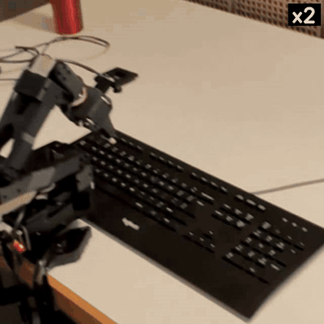
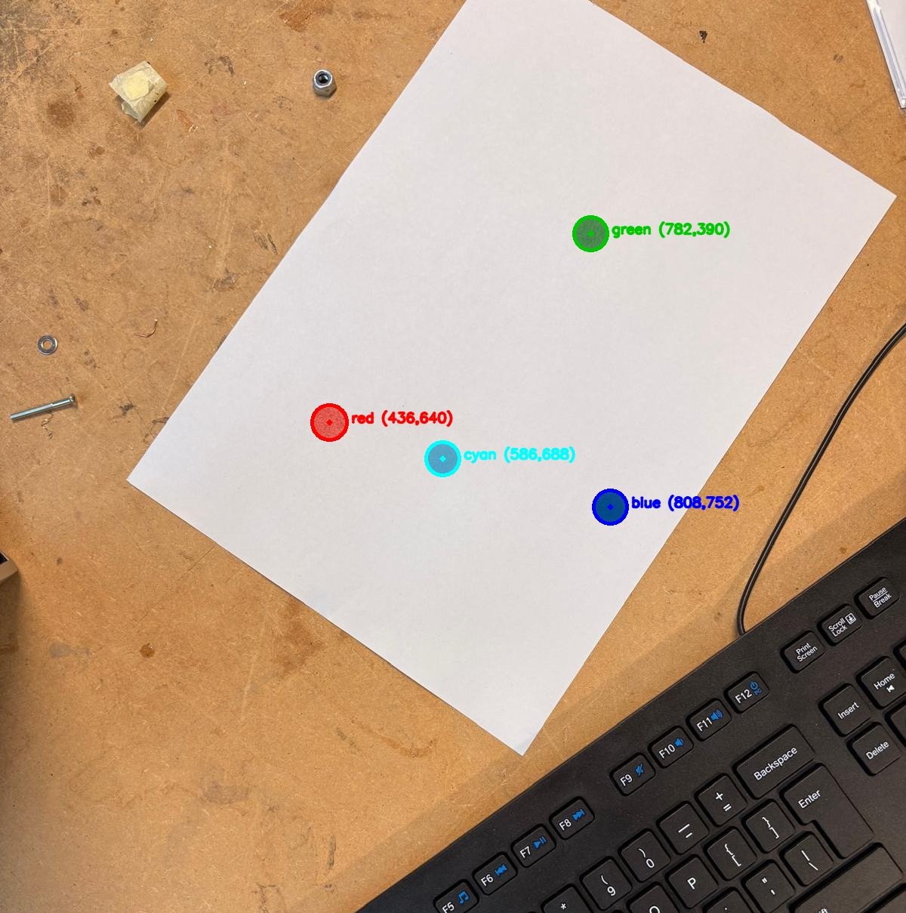
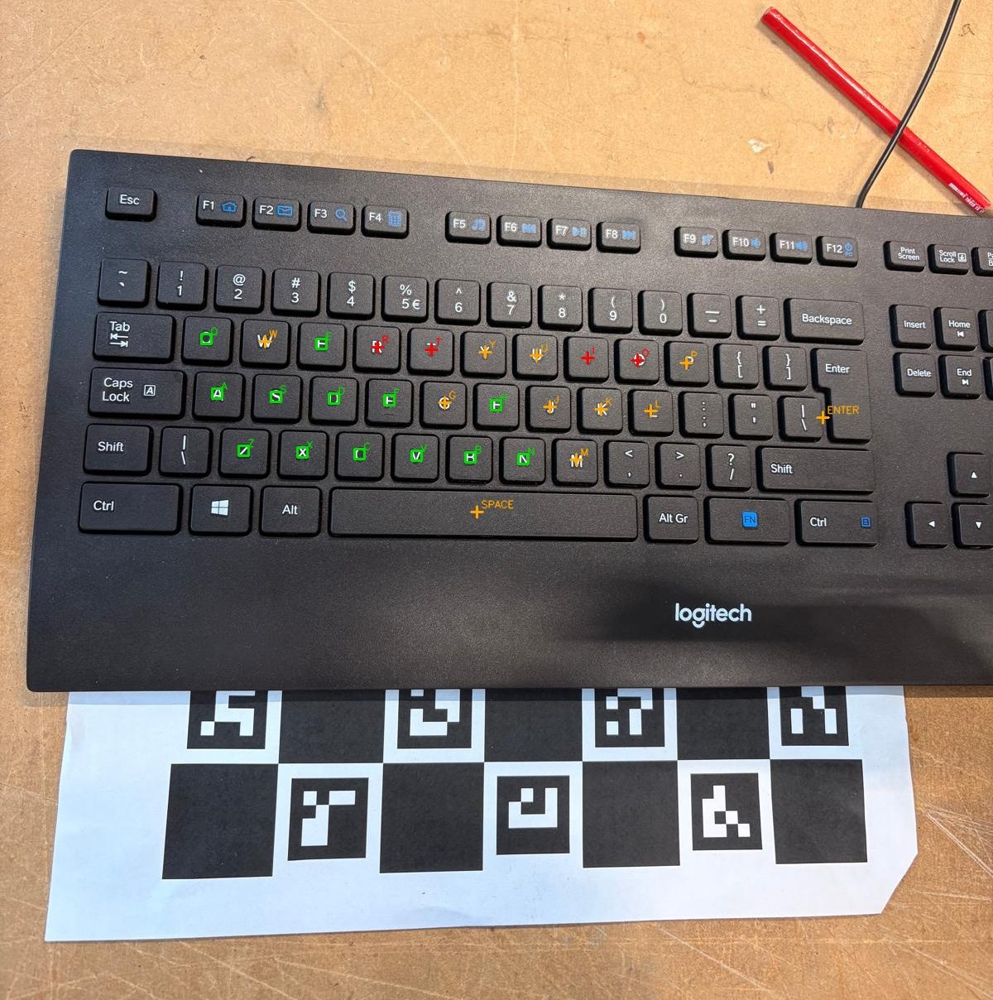

# SoType

*Project for the course Robot Learning: From Fundamentals to Foundation
Models (Oier Mees), ETH Zürich, spring 2026. Vassili De Palma, Benedikt
Jung, Chris Hatoum.*

<table>
  <tr>
    <td valign="top">
      <b>SoType</b> is a robotic arm that types any sentence on a keyboard it
      has never seen, placed at an arbitrary position and orientation. The
      platform is a low-cost 5-DOF LeRobot SO-101 with a webcam on the wrist and
      a pen in the gripper; everything else is perception and control. Keys are
      located from a single overhead frame by reading the printed glyphs with
      OCR and fitting a homography to the canonical US keyboard layout, which
      recovers every key, including those the OCR could not read. Each press is
      then executed by closed-loop visual servoing: a coloured marker on the pen
      tip is tracked in the image and driven onto the target key, and the
      descent stops when the shoulder motor senses contact, so no camera
      calibration or key height is ever assumed.
    </td>
    <td width="360" valign="top">
      
    </td>
  </tr>
</table>

Along the way we evaluated the alternatives for both halves of the
problem, vision-language models for key localisation and open-loop
inverse kinematics on a calibrated camera model for control, and kept
them in the repository as references; the servo loop itself was validated
on coloured dots before being trusted on a keyboard.

## What it does

```bash
python -m evals.eval3_sentence --type "hello world"   # type a sentence
python -m evals.eval2_letter                          # press one letter at a time, from stdin
python -m evals.eval1_dots                            # touch-test: hover over coloured dots in order
```

Given a sentence, the arm looks down at the keyboard, locates every key
from one camera frame, and presses the characters one by one, each time
steering the pen tip onto the key in the live image and finishing the
press by feeling for contact. The keyboard can be moved, rotated or swapped
for another US-layout keyboard between runs without recalibrating.

## How it works

The system is **closed-loop visual servoing**: the arm never converts a
pixel to a robot coordinate through a calibrated camera model. A coloured
marker on the pen tip is tracked in the image and driven onto the target
pixel until the error is a few pixels, then the press is finished by
feeling for contact.

```
                      ┌─ ColorDotTarget   largest blob of the dot colour              (dots)
  wrist camera ──►    │
  frame               └─ KeyTarget        OCR  ─┐  anchors ─► homography to the
                                          VLM  ─┘  canonical US layout ─► key pixel  (keyboard)
                                   │
          tip marker (HSV) ──► pixel error ──► 2×2 gain ──► pinv(J) ──► joint step
                                   │
   phase 1  diagonal approach, descending to 15 mm above the table
   phase 2  planar refinement until |error| < 8 px
   phase 3  vertical descent until the shoulder load reports contact
```

The visual part, on the two kinds of target:

<table>
  <tr>
    <td width="50%"></td>
    <td width="50%"></td>
  </tr>
  <tr>
    <td><sub><b>Dots.</b> Each colour is segmented in HSV and its blob centroid becomes the target pixel. No geometry prior is needed: the target is wherever the colour is.</sub></td>
    <td><sub><b>Keyboard.</b> Green: 13 keys read directly by OCR. Orange: 11 keys OCR could not read, located by the homography from the canonical layout (including SPACE and ENTER). Red: 4 OCR reads that disagreed with the layout by more than a key width and were rejected.</sub></td>
  </tr>
</table>

### 1. Finding the key

OCR (Tesseract) reads whatever letter glyphs it can from one overhead
frame. On a typical frame that is 15 to 22 of the 28 keys we care about;
glare, the pen, and glyphs like `I`/`l` lose the rest. A RANSAC homography
then maps the canonical US layout onto those anchors, which locates every
key, including the ones OCR could not read, and rejects OCR mis-reads that
land more than about one key width from where the layout says they should
be. The space bar, which has no glyph at all, is found this way; the
right-hand image above shows all three cases on a real frame.

The layout file (`configs/us_keyboard_layout.json`) therefore encodes the
*topology* of a US keyboard in unit-pitch coordinates, never positions.
Position, scale, rotation and perspective all come from the image. The
limit is honest: a different layout (AZERTY, ortholinear) would need a
different file or the fit would fail its consensus check.

A vision-language model can replace OCR as the anchor source with
`--detector vlm` (Claude or Gemini by API key, or a local Qwen/Molmo). It
feeds the same homography and is useful when OCR struggles, at a few
seconds of latency per refresh.

### 2. Servoing the tip onto it

Each servo tick, at 10 Hz: read a frame, re-detect the tip marker by HSV,
ask the target for its pixel (the keyboard is re-read every 15 ticks
because the camera moves with the wrist), map the pixel error through a
fixed 2×2 gain into a robot-XY step of at most 2 mm, add a capped Z step
toward the hover height, and solve one pseudo-inverse of the numeric
position Jacobian for all five joints, clipped to 0.5° per tick. The wrist
is re-solved every tick so the camera keeps its scan-pose orientation,
which is what makes the fixed gain valid. Because the loop closes on the
pixel error, the gain only sets how fast it converges, not where it ends.

### 3. Pressing

Phase 3 commands pure −Z steps through the same Jacobian with the wrist
free, so the planned tip path has no lateral component. Contact is
declared when the `shoulder_lift` motor's load deviates from its
in-motion median baseline by more than 60 counts for two consecutive
ticks, or when commanded and measured joints disagree by more than 10°.
No key height is ever assumed. The arm retreats to the hover pose, then
to the scan pose, and the next key starts from a full view of the keyboard.

### The dot test

The same loop was first validated on coloured dots, where the target is
simply the largest blob of the requested colour and there is no OCR in the
way. `evals.eval1_dots` servos the tip over each dot at scan height, then
descends vertically to 10 mm above the table while a closed-loop XY hold
cancels the parallax drift of the dot in the image, holds, and moves to the
next colour. `scripts/touch_color.py` does the full press on a dot. Getting
this to converge reliably is what fixed the servo gain, the orientation
hold and the contact thresholds that the keyboard pipeline then inherited.

### What has to be calibrated

One five-minute routine, `python -m cybertyping.calibration.click_homography`,
per table setup. It locks an overhead scan pose, lets you click points in
the image and place the gripper on each, and writes
`configs/click_homography.json`. The servo reads three things from it: the
scan-pose joint angles, the gripper opening, and the median touched Z as
the table height. The homography it also fits is used only by the
click-to-touch diagnostic, not by the servo. Nothing about the keyboard's
position or size is stored, so moving or swapping the keyboard needs no
recalibration; a much thicker keyboard does, because the hover height is
relative to the touched surface.

## Earlier approaches

Two approaches preceded the servo and are kept in the tree.

**Ask a VLM where the keys are** (`reference/vlm/`). The first
experiments: prompt a vision-language model for a key's pixel centre, or
for all key boxes at once, with backends for a local Qwen2.5-VL, Ollama,
LM Studio, Gemini and Claude. Single-key queries took 3 to 15 s, and full
scans mislabelled neighbouring keys often enough that a geometric
consistency check became mandatory. Once the homography existed, OCR gave
the same anchors offline and for free. The multi-backend code survives as
`cybertyping/perception/detect/vlm_anchors.py`.

**Open-loop calibrated pipeline** (`evals/open_loop/`,
`cybertyping/tasks/session.py`). The same OCR + homography key map, then a
proper camera model: ChArUco intrinsics, hand-eye extrinsics, a probed
table plane, pre-computed IK for every key, stitched joint trajectories
and a press with no camera in the loop. Fast and well tested offline, with
63 unit tests, but on the arm it showed a position-dependent error of 5 to
8 percent that grew toward the image corners. We traced it to a small
rotation residual in the hand-eye calibration, which a 5-DOF arm with a
locked wrist roll cannot excite well enough to estimate, and could not
remove it in the time we had. That is why the final system closes the loop
in image space. The pipeline still runs without hardware:
`CYBERTYPING_DRY_RUN=1 python -m evals.open_loop.eval3_sentence --type "hi" --image frame.jpg`.

## Repository layout

```
evals/                   entry points: eval1_dots, eval1_keys, eval2_letter, eval3_sentence, bonus_fast
  open_loop/             legacy calibrated pipeline entry points
cybertyping/
  core/                  hardware-validated kinematics, IK, 30 Hz streaming, contact descent
  servo/                 Rig, targets (colour / OCR / VLM), servo loop, press recipes, CLI flags
  perception/            capture, detectors (dots, OCR, VLM), canonical layout + homography
  calibration/           click_homography (used); session_calibration, press_depth (legacy)
  analytic_ik/           closed-form IK and touch detector, cross-checked against ikpy
  tasks/ press/ policy/  legacy open-loop pipeline
scripts/                 calibration, camera and dot diagnostics, teleop, hardware demos
reference/vlm/           first VLM experiments (standalone scripts)
configs/                 click_homography.json, us_keyboard_layout.json, rig_calibration.json
tests/                   80 offline unit tests (no robot, no camera)
docs/images/             figures for this README
SO101/                   URDF + meshes (TheRobotStudio/SO-ARM100)
lerobot/                 git submodule (motor driver)
```

The entry-point names follow the evaluation stages of the course project
the arm was built for: `eval1_dots` (dots), `eval1_keys` (a fixed key
sequence), `eval2_letter` (single letters), `eval3_sentence` (sentences),
`bonus_fast` (sentences with the fast preset).

Module map of the servo package, top down:

| Module | Role |
|---|---|
| `servo/press.py` | `press_target` (three phases + retreat) and `hover_target` (dots); `ServoSettings` with a `fast()` preset |
| `servo/control.py` | `servo_to_target`, `descend_to_z`, `descend_until_contact`, `enforce_camera_dir`; all tunables as constants |
| `servo/targets.py` | `find_tip`, `ColorDotTarget`, `KeyTarget`, the OCR and VLM anchor detectors, sentence tokenising |
| `servo/rig.py` | `Rig`: robot connection, ikpy chain, camera, scan pose from `click_homography.json` |
| `core/primitives.py` | the one file that talks to the motors: chain, FK/IK, slew, stream, load-contact descent |
| `core/descent_jac.py` | numeric 3×5 position Jacobian |
| `perception/detect/dots.py` | HSV blob detector for the tip marker and the dots |
| `perception/detect/ocr_anchors.py`, `ocr_backends.py` | Tesseract / EasyOCR / Paddle letter-anchor extraction |
| `perception/keymap/homography.py`, `layout.py` | canonical layout and the RANSAC fit with leave-one-out cross-validation |

Validation status: `core/primitives.py` and the colour-dot servo ran on
the arm. The OCR key press ran on the arm as a standalone script before
this restructuring; the refactored module is behaviour-identical but has
not been re-run on hardware. The VLM detector and the analytic IK are
tested offline only.

## Setup

```bash
git submodule update --init --recursive
pip install -e ./lerobot
pip install -e .                      # or: pip install -r requirements.txt
sudo apt install tesseract-ocr        # macOS: brew install tesseract
cp .env.example .env                  # SO101_PORT, CAMERA_INDEX, optional API keys
pytest -q                             # 80 offline tests, about one second
```

Optional extras: `pip install -e '.[gemini]'` or `'.[claude]'` for
`--detector vlm`; `'.[verify]'` for the host-keyboard listener used by
`eval3_sentence --verify`; `'.[easyocr]'` for the heavier OCR backend.

## Running on the arm

**Hardware.**

```bash
lerobot-find-port                    # -> SO101_PORT
python scripts/probe_cameras.py      # one window per camera -> CAMERA_INDEX of the wrist cam
python scripts/probe_dots.py         # live HSV detections: check the tip marker is picked up
```

Wrap a band of coloured tape around the pen tip: **yellow** for the dot
test (the dots are red, green, blue, cyan), **red** for the keyboard. If
the marker flickers, widen its range in `HSV_RANGES`
(`cybertyping/perception/detect/dots.py`). Only re-run `lerobot-calibrate`
for a new arm.

**Scan pose and table height.**

```bash
python -m cybertyping.calibration.click_homography --camera $CAMERA_INDEX
python scripts/click_to_touch.py     # sanity check: click a pixel, the arm touches it
```

Free-drive to an overhead pose with the whole keyboard in view, ENTER to
lock; click 4 to 10 spread-out points, ENTER; torque releases, place the
gripper on each point, ENTER each time. Re-run when the table, camera
mount or keyboard height changes.

**Rehearsal.**

```bash
python scripts/touch_color.py                    # servo onto a blue dot and touch it
python -m evals.eval2_letter --letters t g       # centre keys
python -m evals.eval2_letter --letters q p z m   # corners
```

In the overlay: green cross = tip, magenta cross = target, yellow boxes =
OCR anchors, cyan crosses = all reprojected keys. If the arm moves *away*
from the target in phase 1, a sign in `IMAGE_TO_ROBOT_GAIN_MAT`
(`cybertyping/servo/control.py`) is wrong for this camera mount. Status
`few_anchors`: retract the pen out of the frame for the first detection,
improve lighting, or set `OCR_MULTI=1`.

**Typing.**

```bash
python -m evals.eval3_sentence --type "hello world"
python -m evals.eval3_sentence                   # one sentence per stdin line
python -m evals.eval3_sentence --verify          # score the result via the host keyboard (pynput)
python -m evals.eval2_letter                     # one letter at a time
python -m evals.eval1_keys                       # fixed sequence: space enter r l
python -m evals.bonus_fast --sentences-file rollouts.txt
```

Every entry point shows the live feed with the overlays and waits for
ENTER before each motion so the operator can check them; `--no-confirm`
starts as soon as tip and target are both visible; `q` or ESC skips the
current target. Default settings take roughly 10 to 20 s per key including
the return to the scan pose. `--fast` loosens the tolerance and skips
confirmation; use it once the default run is reliable, since one miss
costs more than the time saved on every other key.

**Troubleshooting.**

| Symptom | Try |
|---|---|
| No tip in the overlay | lighting or tape colour; `scripts/probe_dots.py`; `--tip-color yellow` |
| Target key not found | `OCR_MULTI=1`; retract the pen; `--detector vlm` with an API key |
| Servo oscillates around the target | lower `MAX_XY_STEP_M` or the gain in `servo/control.py` |
| Phase 3 ends with `max descent` | key is not under the tip: check the table height, re-run click_homography |
| Phase 3 ends instantly with `load` | threshold too low for this motor: raise `load_thresh` in `ServoSettings` |
| Wrist spins during servo | `wrist_roll` must stay in `LOCKED_JOINTS` (`core/primitives.py`) |
| Camera opens but frames are black | wrong backend: try another `CAMERA_INDEX`, close other apps using the camera |

## Attribution

`SO101/` assets are from TheRobotStudio/SO-ARM100; `lerobot/` is a
submodule of huggingface/lerobot. Everything else is project code. The
Python package keeps its original name, `cybertyping`.
